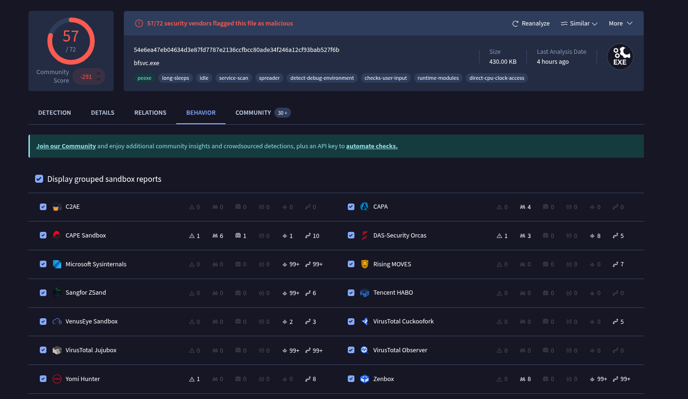

# 🧪 Malware Hash Investigation

## 🔑 File Hash
SHA256: 54e6ea47eb04634d3e87fd7787e2136ccfbcc80ade34f246a12cf93bab527f6b

---

## 🕒 Timeline
- 1:11 p.m.: Employee received email attachment  
- 1:13 p.m.: Employee downloaded and opened file  
- 1:15 p.m.: Unauthorized executable files were created  
- 1:20 p.m.: IDS alert triggered  

---

## 📊 Analysis Summary

After searching the SHA256 hash in VirusTotal, the file appears to be **malicious**.

### 🔍 Reasoning
- Multiple security vendors flagged the file as malicious  
- Community score supports a malicious/suspicious classification  
- Related behavior and infrastructure indicate malicious activity  

---

## 🚨 Indicators of Compromise (IoCs)

### 1. Hash Value
MD5
287d612e29b71c90aa54947313810a25

### 2. IP Address
104.115.151.81

### 3. Domain / Host Artifact / TTP
a.sinkhole.yourtrap.com

---

## 🖼️ Evidence

### Detection

### Relations

### Behavior (optional)

---

## 🧠 Conclusion

The file is confirmed to be malicious based on multiple detection sources and associated indicators of compromise.  
This analysis demonstrates the use of VirusTotal and threat intelligence to support SOC investigation workflows.